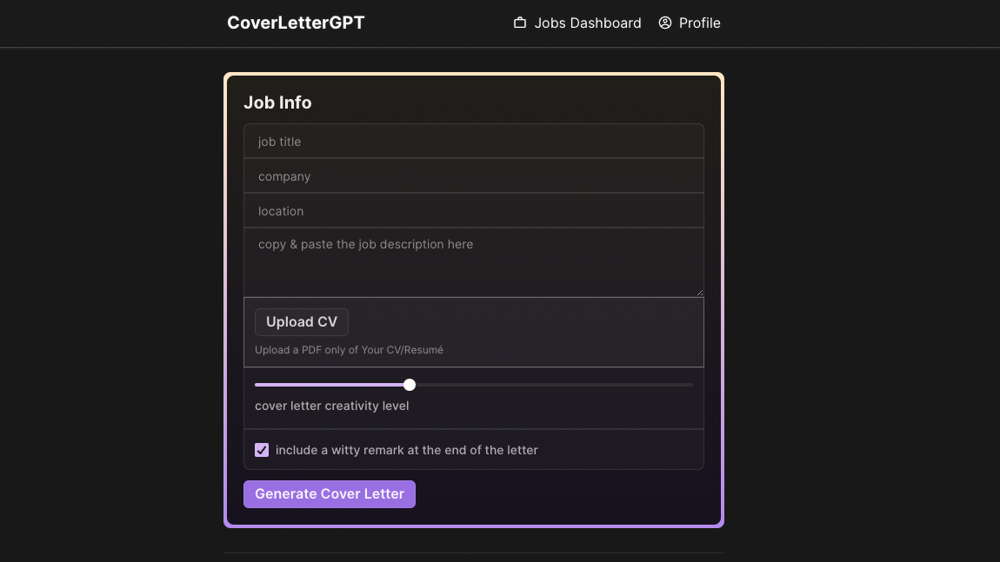

# CoverLetterGPT.xyz

## Running it locally
After cloning this repo, you can run it locally by following these steps:

1. Install [Wasp](https://wasp-lang.dev) by running `curl -sSL https://get.wasp-lang.dev/installer.sh | sh` in your terminal.
2. Create a `.env.server` file in the root of the project
3. Copy the `env.server.example` file contents to `.env.server` and fill in your API keys
4. Make sure you have a Database connected and running. Here are two quick options:
  - run `wasp start db` from the project root. You need to have Docker installed (if not, on MacOS run `brew install docker-machine docker` and start the Docker app). This will start a Postgres database and configure it for you. No need to do anything else!
  - or provision a Postgres database on [Railway](https://railway.app), go to settings and copy the connection url. Paste it as DATABASE_URL=<your-postgres-connection-url> into your env.server file.
5. Run `wasp db migrate-dev`
6. Run `wasp start`
7. Go to `localhost:3000` in your browser (your NodeJS server will be running on port `3001`)
8. install the [Wasp extension for VSCode](https://marketplace.visualstudio.com/items?itemName=wasp-lang.wasp) for the best DX

## How it works

[coverlettergpt.xyz](http://coverlettergpt.xyz) was built in a couple of days using a few really cool tools:

- 🐝 [Wasp](https://wasp-lang.dev) - allows you to build full-stack apps with 10x less boilerplate
- 🎨 [Chakra-ui](https://chakra-ui.com/) - UI components for React that look good and are easy to work with
- 🤖 [OpenAI](https://openai.com/) - GPT-3.5 turbo API
- 💸 [Stripe](https://stripe.com/) - for tip payments

[Wasp](https://wasp-lang.dev) as the full-stack framework allows you to describe your app’s core features in the `main.wasp` config file in the root directory. Then it builds and glues these features into a React-Express-Prisma app for you so that you can focus on writing the client and server-side logic instead of configuring. For example, I did not have to use any third-party libraries for Google Authentication. I just wrote a couple lines of code in the config file stating that I want to use Google Auth, and Wasp configures it for me. Check out the `main.wasp` file for more.

Also, [Chakra-ui](https://chakra-ui.com/) is great for building nice looking UI’s really quickly and easily. Some people are turned off by the fact that they’re React components, but I find that they’re easy to customize and configure, and get me started on designs 10x faster and with less code than tailwind.

For more info on the prompts and configuration I used for the [OpenAI](https://openai.com/) API, check out the `src/server/actions.ts` file.

[Stripe](https://stripe.com/) makes the payment functionality super easy. I just used their `Pre-configured Checkout` feature on a one-time purchase product. After the user pays, I update their `hasPaid` and `datePaid` fields in the database. Then I use [Wasp's integrated Jobs](https://wasp-lang.dev/docs/language/features#jobs) feature to run a cron job that checks if 3 months has passed since paying, and if so, it sets `hasPaid` to `false` again.

I also implemented a cron job to send an email to the user to notify them 2 weeks before their subscription ends. I used [SendGrid](https://sendgrid.com/) for the email service.

If you have any other questions, feel free to reach out to me on [twitter](https://twitter.com/hot_town)
